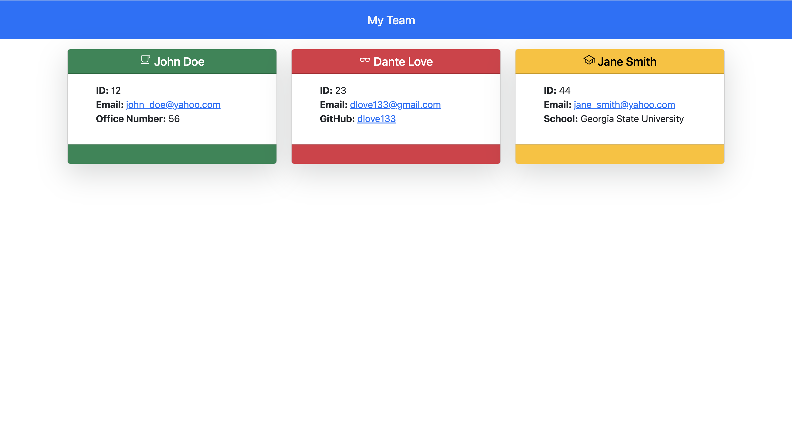

# Team Page Generator

## Description

A Node.js command-line application that takes in information about employees on a software engineering team, then generates an HTML webpage that displays summaries for each employee.

## Table of Contents

- [Installation](#installation)
- [Usage](#usage)
- [License](#license)
- [Contributing](#contributing)
- [Tests](#tests)
- [Questions](#questions)

## Installation

In your command-line interface, please invoke the command "npm install" to install all of the dependicies to run the application.

## Usage

Once installed (Refer to [Installation Instructions](#installation)) then you can run the application by invoking the commands "npm start" or "npm index.js".
You will be prompted to enter each employee's:

- Name
- Id
- Email
- Office Number (Team Managers Only)
- GitHub Username (Engineers Only)
- School (Interns Only)

## License

This application is covered by the MIT License

## Tests

To run the tests for this project, you will need to have Jest installed. You can install it by running the following command 'npm install'. Once Jest is installed, you can run the tests by executing the following command in your terminal 'npx test'; This will run all the tests in the `__tests__` directory. You can also run specific test files by running the command 'npx jest fileName.test.js', where fileName is the name of the file you want to test.

## Questions

Any additional questions? Please contact me via:

- Github: https://github.com/dlockett133
- Email: daikeen_lockett@yahoo.com
